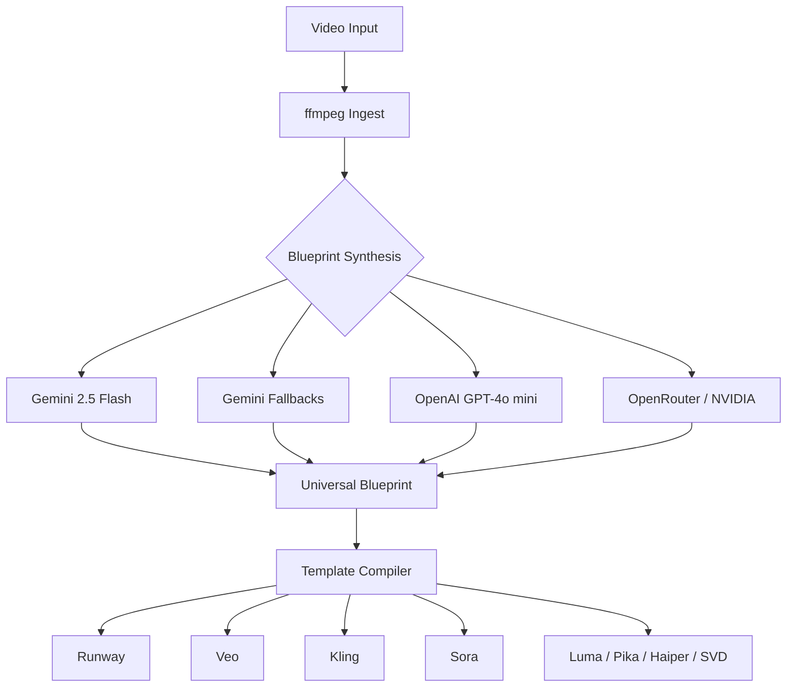

# VideoReverse

<p align="center">
  <strong>Universal Video-to-Prompt Pipeline</strong><br>
  Deconstruct any video → universal blueprint → prompts for Runway, Veo, Kling, Sora, Luma, Pika, Haiper, SVD
</p>

<p align="center">
  <a href="https://github.com/Venkata-Manoj/videoreverse"></a>
  <a href="LICENSE"></a>
  <a href="https://github.com/Venkata-Manoj/videoreverse/actions"></a>
  <a href="https://github.com/Venkata-Manoj/videoreverse/stargazers"></a>
  <a href="https://github.com/Venkata-Manoj/videoreverse/commits/main"></a>
  <a href="https://github.com/Venkata-Manoj/videoreverse/graphs/contributors"></a>
</p>

> 📖 **For the full product story, features, and use cases → [docs/product-readme-draft.md](docs/product-readme-draft.md)**

---

## 🚀 Quick Start

### Prerequisites

- **Python 3.12+** — [Install via pyenv](https://github.com/pyenv/pyenv)
- **ffmpeg** — `apt install ffmpeg` or `brew install ffmpeg`
- **GEMINI_API_KEY** — Get from [Google AI Studio](https://aistudio.google.com/)

### Install & Run

```bash
git clone https://github.com/Venkata-Manoj/videoreverse.git
cd videoreverse
pip install -r requirements.txt
cp .env.example .env   # Add your GEMINI_API_KEY

# Full pipeline
python -m src.main ./video.mp4

# Specific models
python -m src.main ./video.mp4 --model runway_gen4_5,google_veo3_1

# No API key? Use mock mode (zero cost)
python -m src.main ./video.mp4 --mock

# Web UI
python -m web   # Open http://127.0.0.1:7860
```

### Docker

```bash
docker compose run --rm vidrev src.main ./video.mp4
```

### Options

| Flag | Description | Default |
|------|-------------|---------|
| `--model, -m` | Models (comma-separated) | All |
| `--output-dir, -o` | Output directory | `output_blueprints/` |
| `--format` | `json`, `txt`, `both`, `none` | `both` |
| `--verbose, -v` | Debug logging | `false` |
| `--dry-run` | Output without saving | `false` |
| `--force, -F` | Skip failed steps | `false` |
| `--max-retries, -r` | API retry attempts | `2` |
| `--max-frames` | Max frames to extract | `60` |
| `--max-duration` | Pre-clip to N seconds | — |
| `--sample-mode` | `full`, `first-n`, `highlights` | `full` |
| `--video-type` | Override auto-detected type | Auto |
| `--no-compress` | Skip video compression | `false` |
| `--compress-width` | Compress target width | `720` |
| `--no-cache` | Disable blueprint caching | `false` |
| `--no-transcribe` | Skip Whisper transcription | `false` |
| `--rate-limit-rpm` | Max API requests per minute | `5` |
| `--gemini-model` | Gemini model for analysis | `gemini-2.5-flash` |
| `--mock` | Synthetic blueprint, no API calls | `false` |
| `--frames-only` | Send frames as inline images | `false` |
| `--blur-threshold` | Min sharpness score (0=disable) | `100` |

---

## ⚙️ Configuration

### Environment Variables

| Variable | Description | Default | Required |
|----------|-------------|---------|----------|
| `GEMINI_API_KEY` | Gemini API key for synthesis | — | ✅ |
| `OPENAI_API_KEY` | OpenAI fallback key | — | ❌ |
| `GROQ_API_KEY` | Groq Whisper transcription key | — | ❌ |
| `VIDEO_REV_OUTPUT_DIR` | Output directory | `output_blueprints/` | ❌ |
| `VIDEO_REV_CONFIG_DIR` | Config directory | `config/` | ❌ |

### Supported Gemini Models

| Model | RPM | TPM | RPD | Notes |
|-------|-----|-----|-----|-------|
| `gemini-2.5-flash` | 3 | 2,110 | 11 | Default |
| `gemini-3.5-flash` | 1 | 1,960 | 2 | Latest, best quality |
| `gemini-2.5-flash-lite` | 2 | 1,390 | 4 | Lighter, faster |
| `gemini-3.1-flash-lite` | 15 | 250K | 500 | High rate limit |
| `gemini-3-flash` | 5 | 250K | 20 | Good fallback |

Rate limits enforced by sliding window limiter. Exhausted models trigger automatic fallback.

---

## 🏗️ Architecture



### Core Components

| Component | Purpose |
|-----------|---------|
| `src/ingest.py` | Video metadata, frame extraction, audio analysis |
| `src/synthesize.py` | Gemini synthesis (primary) |
| `src/synthesize_openai.py` | OpenAI GPT-4o mini fallback |
| `src/synthesize_free_api.py` | OpenRouter Kimi + NVIDIA Nemotron fallbacks |
| `src/compile.py` | Config-driven prompt compiler |
| `src/export.py` | JSON → TXT formatter |
| `utils/rate_limiter.py` | Per-model RPM/TPM/RPD enforcement |

### Universal Blueprint Schema

```json
{
  "global_aesthetic": {
    "art_style": "cinematic",
    "color_grading": "warm",
    "lighting_setup": "natural"
  },
  "chronological_shots": [
    {
      "shot_index": 0,
      "duration_seconds": 5.0,
      "camera_direction": "static",
      "framing_type": "wide",
      "action_and_motion": "character walking",
      "environment_context": "forest",
      "negative_elements": ["blur", "noise"]
    }
  ]
}
```

---

## 🧪 Testing

```bash
python -m pytest tests/unit/
python scripts/lint.py
python scripts/validate.py
python scripts/verify_output.py test1.mp4 --strict
```

### Test Videos

| File | Type |
|------|------|
| `test1.mp4` | CGI/Animation |
| `test_drone.mp4` | Aerial footage |
| `test_anime.mp4` | 2D Animation |
| `test_vlog.mp4` | Handheld multi-cut |

---

## 🔄 CI/CD

| Workflow | Trigger | Purpose |
|----------|---------|---------|
| `ci.yml` | Push/PR | Lint + Tests (Ubuntu, Windows, macOS) |
| `release.yml` | Tag | PyPI publish + Docker Hub |
| `security-scan.yml` | Weekly | Secret scanning + SBOM |

---

## 🤝 Contributing

See [CONTRIBUTING.md](./CONTRIBUTING.md). Use conventional commits:

```
feat(scope): description
fix(scope): description
```

---

## 📜 License & Security

MIT License — see [LICENSE](./LICENSE). Report vulnerabilities via [SECURITY.md](./SECURITY.md).

---

<p align="center">
  <a href="https://github.com/Venkata-Manoj/videoreverse">GitHub</a> •
  <a href="docs/product-readme-draft.md">Product Story</a> •
  <a href="docs/cli-reference.md">CLI Reference</a> •
  <a href="CHANGELOG.md">Changelog</a>
</p>
