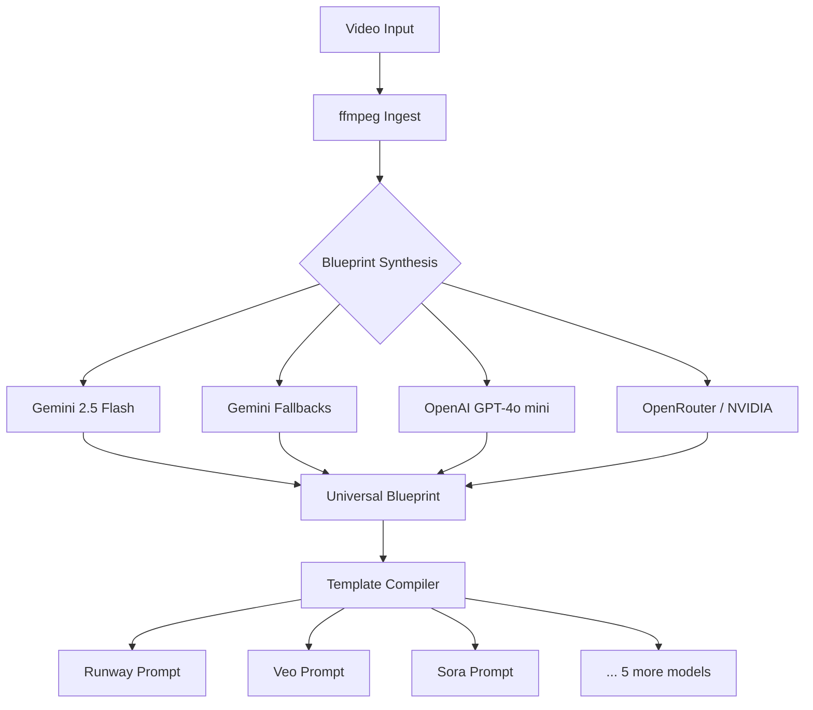

# VideoReverse

<p align="center">
  <strong>Turn any video into production-ready AI prompts</strong><br>
  One command deconstructs video → universal blueprint → model-specific prompts for Runway, Veo, Kling, Sora, Luma, Pika, Haiper, SVD
</p>

<p align="center">
  <a href="https://github.com/Venkata-Manoj/videoreverse"></a>
  <a href="LICENSE"></a>
  <a href="https://github.com/Venkata-Manoj/videoreverse/actions"></a>
  <a href="https://github.com/Venkata-Manoj/videoreverse/stargazers"></a>
  <a href="https://pypi.org/project/vidrev/"></a>
  <a href="https://hub.docker.com/r/venkatamanoj/vidrev"></a>
  <a href="https://github.com/Venkata-Manoj/videoreverse/commits/main"></a>
  <a href="https://github.com/Venkata-Manoj/videoreverse/graphs/contributors"></a>
</p>

<p align="center">
  <a href="#quick-start">Quick Start</a> •
  <a href="#features">Features</a> •
  <a href="#cli-reference">CLI Reference</a> •
  <a href="#architecture">Architecture</a> •
  <a href="CHANGELOG.md">Changelog</a>
</p>

---

## 🚀 Quick Start

### Docker (fastest — no Python required)

```bash
docker compose run --rm vidrev src.main ./video.mp4
```

### pip install

> **Note:** `vidrev` is not yet available on PyPI — coming soon. Use Docker or source for now.

```bash
pip install vidrev
vidrev ./video.mp4          # CLI
vidrev-web                   # Web UI at http://localhost:7860
```

### From source

```bash
git clone https://github.com/Venkata-Manoj/videoreverse.git
cd videoreverse
pip install -r requirements.txt
# Add GEMINI_API_KEY to .env
python -m src.main ./video.mp4
```

> 💡 **No API key?** Use `--mock` to see a synthetic blueprint with zero cost.

---

## ✨ Features

| Icon | Feature | Description |
|------|---------|-------------|
| 🎯 | Universal Blueprint | One analysis → prompts for every major video AI model |
| 🔄 | Smart Fallback Chain | Gemini → OpenAI → OpenRouter → NVIDIA — never get blocked |
| 🎞️ | Intelligent Sampling | Highlights mode extracts best segments; frame capping limits cost |
| 📦 | Docker Ready | Single command, no Python install needed |
| 🖥️ | Web UI Included | Drag-and-drop, URL input, real-time progress, model picker |
| 🔒 | Privacy First | All processing local; API key stays on your machine |
| 📋 | Dual Output | Machine-readable JSON + human-friendly TXT |
| 🧪 | Mock Mode | Test the entire pipeline without any API key or cost |
| 🎨 | 8+ Model Templates | Runway, Veo, Kling, Sora, Luma, Pika, Haiper, SVD |
| ⚡ | Rate Limit Aware | Sliding window RPM/TPM/RPD enforcement — stay within free tiers |

---

## 🎬 See It In Action

> *Demo GIFs coming soon — recordings of CLI pipeline and Web UI workflow*

---

## 🤔 Why VideoReverse?

| Problem | Solution |
|---------|----------|
| Writing AI video prompts is manual & slow | One video → 8+ model-specific prompts automatically |
| Each model needs different prompt syntax | Template engine handles per-model formatting |
| API rate limits block batch work | Built-in RPM/TPM/RPD throttler with automatic fallback |
| Long videos cost too many tokens | Smart frame capping + blur filtering + compression |
| No consistent way to evaluate prompt quality | Universal blueprint ensures structural consistency |

---

## 👷 Architecture



### Pipeline Flow

VideoReverse is a modular pipeline that deconstructs videos into production blueprints, then compiles model-specific prompts.

| Component | Location | Purpose |
|-----------|----------|---------|
| `main.py` | `src/` | CLI entry point, argument parsing |
| `pipeline.py` | `src/` | Orchestrator, chains all modules |
| `ingest.py` | `src/` | Video metadata extraction (ffmpeg), audio analysis, transcription |
| `synthesize.py` | `src/` | Gemini File API integration with fallback chain |
| `compile.py` | `src/` | Prompt compilation from model templates |
| `export.py` | `src/` | JSON to human-readable TXT formatter |
| `path_resolver.py` | `src/` | Cross-platform path normalization |

### Fallback Chain

If the primary Gemini model fails, the pipeline automatically falls back through progressively lighter models:

1. **Gemini 2.5 Flash** (primary) → **Gemini 2.5 Flash Lite** → **Gemini 3.1 Flash Lite** → **Gemini 3 Flash**
2. **OpenAI GPT-4o mini** (if `OPENAI_API_KEY` is set)
3. **OpenRouter Kimi K2.6** (text-only, 1 frame — if `OPENROUTER_API_KEY` is set)
4. **NVIDIA Nemotron Nano VL 8B** (multi-image vision — if `NVIDIA_NIM_API_KEY` is set)

**Fallback Details:**
- Each fallback model is progressively lighter in terms of parameters and capabilities
- The pipeline automatically detects when a model has failed and triggers the next fallback
- External API fallbacks (OpenAI, OpenRouter, NVIDIA) only trigger after all Gemini models have been exhausted
- Each fallback model has different rate limits and capabilities, which are enforced by the sliding window rate limiter

---

## 💡 Use Cases

- **AI Video Creators** — Reverse-engineer reference clips into reproducible prompts
- **Prompt Engineers** — Build a library of high-quality prompts from curated videos
- **Researchers** — Compare how different models interpret the same source video
- **Content Pipelines** — Automate prompt generation for batch video production
- **Educators** — Demonstrate video AI capabilities with consistent, reproducible examples

---

## ⚙️ Configuration

### Environment Variables

| Variable | Description | Default | Required |
|----------|-------------|---------|----------|
| `GEMINI_API_KEY` | Gemini API key for blueprint synthesis | — | ✅ |
| `OPENAI_API_KEY` | OpenAI API key for fallback synthesis (when Gemini is unavailable) | — | ❌ |
| `GROQ_API_KEY` | Groq API key for Whisper transcription (`whisper-large-v3`) | — | ❌ |
| `OPENROUTER_API_KEY` | OpenRouter API key (Kimi K2.6 fallback) | — | ❌ |
| `NVIDIA_NIM_API_KEY` | NVIDIA NIM API key (Nemotron VL 8B fallback) | — | ❌ |
| `VIDEO_REV_OUTPUT_DIR` | Output directory | `output_blueprints/` | ❌ |
| `VIDEO_REV_CONFIG_DIR` | Config directory | `config/` | ❌ |
| `VIDEO_REV_LOG_LEVEL` | Log level: `debug`, `info`, `warn`, `error`, `quiet` | `info` | ❌ |

### Supported Gemini Models

| Model | RPM | TPM | RPD | Notes |
|-------|-----|-----|-----|-------|
| `gemini-2.5-flash` | 3 | 2,110 | 11 | Default, good quality/rate balance |
| `gemini-3.5-flash` | 1 | 1,960 | 2 | Latest, best quality, very limited |
| `gemini-2.5-flash-lite` | 2 | 1,390 | 4 | Lighter, faster |
| `gemini-3.1-flash-lite` | 15 | 250K | 500 | High rate limit, lower quality |
| `gemini-3-flash` | 5 | 250K | 20 | Good fallback |
| `gemini-flash-latest` | 3 | 2,110 | 11 | Alias for 2.5-flash |
| `gemini-flash-lite-latest` | 2 | 1,390 | 4 | Alias for 2.5-flash-lite |

Limits are enforced by the sliding window rate limiter (`utils/rate_limiter.py`) before each API call. If a model's RPM/TPM/RPD is exhausted, the pipeline automatically falls back through lighter Gemini models before trying external APIs.

---

## 📖 CLI Reference

### Usage

```bash
python -m src.main <video_path_or_url> [options]
```

### Options

| Flag | Description | Default |
|------|-------------|---------|
| `--help, -h` | Show help message | — |
| `--model, -m` | Specific models (comma-separated) | All models |
| `--output-dir, -o` | Custom output directory | `output_blueprints/` |
| `--format` | Output format: `json`, `txt`, `both`, `none` | `both` |
| `--verbose, -v` | Debug logging | `false` |
| `--quiet, -q` | Suppress console output | `false` |
| `--dry-run` | Output without saving files | `false` |
| `--force, -F` | Skip failed steps, use cached results | `false` |
| `--max-retries, -r` | API retry attempts | `2` |
| `--max-frames` | Max frames to extract (reduces token usage) | `60` |
| `--max-duration` | Pre-clip video to N seconds | — |
| `--sample-mode` | Sampling: `full`, `first-n`, `highlights` | `full` |
| `--video-type` | Override auto-detected video type | Auto |
| `--no-compress` | Skip video compression before API upload | `false` |
| `--compress-width` | Target width for compression (min: 360) | `720` |
| `--no-cache` | Disable blueprint caching | `false` |
| `--no-transcribe` | Skip local Whisper transcription | `false` |
| `--rate-limit-rpm` | Max API requests per minute | `5` |
| `--gemini-model` | Gemini model for analysis | `gemini-2.5-flash` |
| `--mock` | Skip API calls, synthetic blueprint | `false` |
| `--frames-only` | Send frames as inline images instead of full video upload. Token cost bounded by `--max-frames` | `false` |
| `--no-file-api` | Alias for `--frames-only` | `false` |
| `--blur-threshold` | Minimum sharpness score (Laplacian variance). Higher = stricter. 0 = disable. | `100` |
| `--aggressive-blur-filter` | Also drop blurry-high-motion frames where both adjacent frames are sharp (requires --blur-threshold). Useful for removing transient pan/zoom artifacts. | `false` |
| `--wsl` | Force WSL path conversion | Auto |
| `--win` | Force Windows path mode | Auto |

### Examples

```bash
# Full pipeline
python -m src.main ./video.mp4

# Specific models
python -m src.main ./video.mp4 --model runway_gen4_5,google_veo3_1

# Text output only
python -m src.main ./video.mp4 --format txt

# Dry run with verbose logging
python -m src.main ./video.mp4 --dry-run --verbose

# Use a specific Gemini model with rate limit
python -m src.main ./video.mp4 --gemini-model gemini-3.5-flash --rate-limit-rpm 1

# Mock mode (no API calls)
python -m src.main ./video.mp4 --mock

# Highlights mode (extract best 30 seconds)
python -m src.main ./video.mp4 --sample-mode highlights --max-duration 30

# Aggressive blur filtering (remove transient pan/zoom artifacts)
python -m src.main ./video.mp4 --aggressive-blur-filter --blur-threshold 100

# Custom output directory
python -m src.main ./video.mp4 --output-dir my_results --format json
```

---

## 📋 Universal Blueprint Schema

```json
{
  "global_aesthetic": {
    "art_style": "cinematic",
    "color_grading": "warm",
    "lighting_setup": "natural"
  },
  "chronological_shots": [
    {
      "shot_index": 0,
      "duration_seconds": 5.0,
      "camera_direction": "static",
      "framing_type": "wide",
      "action_and_motion": "character walking",
      "environment_context": "forest",
      "negative_elements": ["blur", "noise"]
    }
  ]
}
```

This schema is enforced via Pydantic V2 (`schemas/blueprint.py`) and generated dynamically as a Gemini `responseSchema`. Every blueprint follows this structure, ensuring consistency across models and runs.

---

## 🧪 Testing & CI/CD

### Local Development

```bash
# Install dependencies
pip install -r requirements.txt

# Run all tests
python -m pytest tests/unit/

# Run linter
python scripts/lint.py

# Validate outputs
python scripts/validate.py

# Verify the latest saved output without rerunning the pipeline
python scripts/verify_output.py test1.mp4 --strict
```

### Docker Build

```bash
docker build -t vidrev .
docker run -v ./videos:/data/videos -e GEMINI_API_KEY=your_key vidrev ./data/videos/input.mp4
```

### Test Videos

| File | Description |
|------|-------------|
| `test1.mp4` | CGI/Animation |
| `test_drone.mp4` | Aerial footage |
| `test_anime.mp4` | 2D Animation |
| `test_vlog.mp4` | Handheld multi-cut |

### CI/CD Workflows

| Workflow | Trigger | Purpose |
|----------|---------|---------|
| [`ci.yml`](.github/workflows/ci.yml) | Push/PR | Lint + Tests on Ubuntu, Windows, macOS |
| [`release.yml`](.github/workflows/release.yml) | Tag | PyPI publish + Docker Hub |
| [`security-scan.yml`](.github/workflows/security-scan.yml) | Weekly | Secret scanning + SBOM |

---

## 🤝 Contributing

Contributions are welcome! Please read [CONTRIBUTING.md](./CONTRIBUTING.md) for guidelines.

### Development Workflow

```bash
# 1. Fork the repository
# 2. Create a feature branch
git checkout -b feature/my-feature

# 3. Make changes and test
python -m pytest tests/unit/

# 4. Commit with clear message
git commit -m "feat(scope): description"

# 5. Push and open PR
git push origin feature/my-feature
```

### Commit Message Format

```text
type(scope): description

Types: feat, fix, docs, refactor, test, chore
```

---

## ⭐ Support the Project

If VideoReverse saves you time or helps you create better prompts:

- ⭐ **Star the repo** — helps others discover it
- 🐛 **Report bugs** via [GitHub Issues](https://github.com/Venkata-Manoj/videoreverse/issues)
- 💡 **Request features** — we're actively developing
- 🤝 **Contribute** — see [CONTRIBUTING.md](./CONTRIBUTING.md)

---

## 📜 License

MIT License — see [LICENSE](./LICENSE) for details.

## 🔒 Security

See [SECURITY.md](./SECURITY.md) for vulnerability reporting.

**Key practices:**
- Never commit `.env` files
- Rotate `GEMINI_API_KEY` regularly
- Use `.env.example` as template

## 📋 Compatibility Matrix

| Component | Supported Versions |
|-----------|-------------------|
| Python | 3.12+ |
| ffmpeg | Latest |
| Gemini API | v1 |
| OS | Ubuntu, Windows (WSL), macOS |
| Video formats | MP4, MOV, AVI, WebM (ffmpeg-supported) |

---

<p align="center">
  <strong>Built for the AI video generation community</strong><br>
  <a href="https://github.com/Venkata-Manoj/videoreverse">GitHub</a> •
  <a href="#quick-start">Quick Start</a> •
  <a href="CHANGELOG.md">Changelog</a> •
  <a href="docs/cli-reference.md">Docs</a>
</p>
