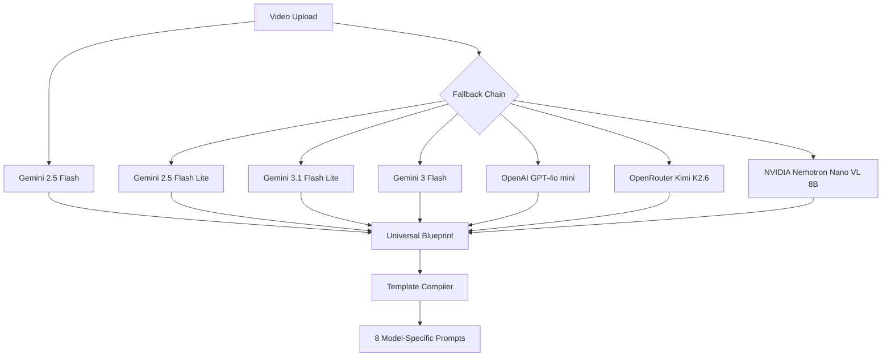

# How We Built VideoReverse

**From idea to production — how AI and systematic engineering created a universal video-to-prompt pipeline**

---

## Overview

VideoReverse is an open-source pipeline that deconstructs any video into a structured "universal blueprint" and then compiles model-specific prompts for eight major video AI generation platforms (with variant versions for Luma and Pika, totaling 10 prompt templates): Runway, Veo, Kling, Sora, Luma, Pika, Haiper, and SVD. One command replaces what was previously a manual, error-prone process of watching a reference video, reverse-engineering its composition, and hand-writing prompts in different syntaxes for each target model.

The problem VideoReverse solves is straightforward: AI video prompting is fragmented. Each model expects different syntax, formatting, and levels of detail. Prompt engineers waste hours manually analyzing reference clips and reformatting descriptions. There was no standard way to describe a video once and have that description adapted for every generation model. The project was built to create that standard — a single, structured analysis that any model's prompt engine can consume.

The team behind VideoReverse wanted to push the boundaries of what a small, focused tool could achieve by leveraging AI not just in the product itself but also in the process of building it. The entire codebase was developed using AI-assisted coding workflows, with an AI agent (Claude/Codex via opencode) acting as a pair programmer across design, implementation, testing, and documentation. This document captures both what the project does and how it was built.

---

## AI in the Product

The product's core intelligence is a multi-tier AI architecture designed for reliability, cost optimization, and graceful degradation.

### Primary Analysis Engine

The pipeline begins with **Gemini 2.5 Flash** via Google's File API. The full video — optionally compressed and smart-sampled — is uploaded to Gemini for multimodal analysis. The key architectural choice here is the use of **Gemini's `response_schema` parameter**: the Pydantic V2 `UniversalBlueprint` model is serialized to JSON Schema and passed directly to Gemini to enforce structured JSON output at the API level — no parsing hacks, no regex extraction, no post-processing guesswork. The model is told to analyze the video and produce output that strictly conforms to the schema.

### Fallback Chain

No single AI service is perfectly reliable. Rate limits, service outages, and quota exhaustion are inevitable in production pipelines. VideoReverse implements a four-tier fallback strategy:

1. **Gemini family** — four models tried in order: `gemini-2.5-flash` (primary), `gemini-2.5-flash-lite`, `gemini-3.1-flash-lite`, `gemini-3-flash`. Each is progressively lighter in capability and cost, with rate limits that vary per model (RPM: 3 → 2 → 15 → 5). Users can also select `gemini-3.5-flash` as the primary via `--gemini-model` for the latest quality at tighter rate limits.
2. **OpenAI GPT-4o mini** — activated only if `OPENAI_API_KEY` is set. Uses frame sampling (up to 15 frames) with base64-encoded inline images.
3. **OpenRouter Kimi K2.6** — a free-tier fallback via OpenRouter. Text-only, limited to a single frame, but entirely free.
4. **NVIDIA Nemotron Nano VL 8B** — a free multi-image vision model via NVIDIA's NIM API. Can process up to 12 frames with a generous free tier.

The fallback chain is not just a safety net — it is a cost optimization strategy. The primary Gemini model handles the vast majority of requests. Cheaper models handle the overflow. Free models handle the rest. A sliding window rate limiter (`utils/rate_limiter.py`) enforces per-model RPM, TPM, and RPD limits before every API call, preventing 429 errors before they occur.

### Transcription Pipeline

Audio transcription follows a similar dual-path strategy. The **Groq Whisper API** (running `whisper-large-v3`) is the primary backend. If Groq is unavailable or no `GROQ_API_KEY` is set, the pipeline falls back to local `openai-whisper` using the `tiny` model by default for speed (configurable via `whisper_model` option). This ensures transcription always works regardless of network conditions.

---

## AI in the Development Process

The most distinctive aspect of VideoReverse's construction is not just the AI in the product — it is the AI used to build the product. The entire codebase was developed using an AI-assisted coding workflow.

### AI-Assisted Pair Programming

The vast majority of the VideoReverse codebase was developed using Claude/Codex running via **opencode**, an agentic coding framework. The development process resembled pair programming with a very knowledgeable partner who never gets tired. The workflow was:

- **Describe the feature** in natural language (e.g., "add a frame blur filter that drops frames below a Laplacian variance threshold")
- **Generate the implementation** — Codex produces initial code following existing patterns
- **Review and refine** — The output is inspected for correctness, edge cases, and style consistency
- **Test** — `pytest` runs confirm the feature works
- **Iterate** — Fix issues surfaced by testing or review

This cycle was repeated hundreds of times across the project's lifetime. The key insight is that AI coding tools are not magic — they require clear specification, active review, and disciplined testing. But they dramatically compress the time between idea and working code.

### Prompt Engineering for Prompts

Building the template system required an unusual meta-application of prompt engineering: writing prompts that write prompts. The `config/prompt_templates.json` file contains templates for each of the eight supported video AI models. Each template uses placeholders like `{camera}`, `{framing}`, `{action}`, and `{environment}` that get filled from the universal blueprint.

Developing these templates required iterative testing:

- **Initial draft** — Write a template based on the model's documentation
- **Generate blueprint** — Run a test video through the pipeline
- **Compile prompt** — Fill the template with blueprint data
- **Verify output** — Inspect the generated prompt for correctness against that model's expected syntax
- **Refine** — Adjust the template to handle edge cases, improve phrasing, and match the model's recommended prompt structure

This was done for each of the eight models, with about three to five iterations per model. The AI coding assistant was used to generate initial templates based on documentation scraping, and also to review generated prompts for issues.

### Schema-First Development

One of the most consequential architectural decisions was defining the Pydantic V2 schema early in development. The `UniversalBlueprint`, `ChronologicalShot`, `GlobalAesthetic`, and `FrameReference` models in `src/schemas/blueprint.py` were written before most of the pipeline logic.

This schema-first approach meant:

- The **synthesize module** (`src/synthesize.py`) was built around producing output conforming to the schema
- The **compile module** (`src/compile.py`) was built around consuming the schema's structure
- The **validation module** (`utils/validation.py`) used Pydantic's built-in validators to catch malformed output
- The **Gemini integration** used `UniversalBlueprint.model_json_schema()` to generate a `responseSchema` — ensuring Gemini's output matched the expected structure

The schema served as a contract between every module in the pipeline. Changes to one end of the pipeline were caught immediately by schema violations at the other end. This prevented the kind of cascading breakage that plagues pipelines built around ad-hoc dictionaries.

### Agent-Based Task Execution

Opencode supports specialized subagents for different phases of development. The project made use of:

- **Architect agents** for designing module interfaces and data flow (e.g., how should the blueprint flow from synthesize to compile to export?)
- **Implement agents** for writing code against those interfaces
- **Tester agents** for generating pytest test cases and running test suites
- **Review agents** for linting, style checking, and code review
- **Debug agents** for diagnosing test failures and runtime errors

Each phase of development would invoke the appropriate agent type. An architect agent would lay out the module structure, an implement agent would fill in the functions, a tester agent would validate edge cases, and a review agent would flag style issues. This multi-agent workflow mirrors a human development team but runs in minutes rather than days.

### Iterative Refinement Loop

Every feature went through the same loop:

1. **Generate** — Codex produces an initial implementation
2. **Review** — Human and AI review the code for correctness and fit
3. **Test** — Automated tests validate the feature
4. **Fix** — Issues found in testing are addressed
5. **Repeat** — Until tests pass and the feature meets requirements

This loop was especially important for the AI fallback chain. Getting the retry logic, error handling, and rate limiting right required multiple cycles. The first implementation of the fallback chain was a flat if-else cascade. After review, it was refactored into a loop over available backends with exponential backoff. After testing, the sliding window rate limiter was added to prevent unnecessary fallback activations. Each cycle improved the design.

---

## Key Architecture Decisions

### Pydantic V2 + responseSchema

The decision to use Pydantic V2's `model_json_schema()` method to generate a Gemini `responseSchema` was the single most important architectural choice. It means:

- Gemini is constrained to output valid JSON matching the schema at the API level
- The pipeline never needs to parse, extract, or heuristically fix malformed JSON
- Schema validation is automatic and strict — if Gemini deviates, the call fails fast
- Changes to the schema propagate to Gemini automatically with no prompt changes needed

This eliminated an entire class of bugs. Previous iterations of the project (before Pydantic schemas were used with `responseSchema`) suffered from Gemini occasionally omitting fields, using wrong types, or returning garbled JSON. The `responseSchema` approach eliminated these issues entirely.

### Modular Pipeline Design

The pipeline is structured as four discrete stages connected by typed data contracts:

1. **Ingest** — ffmpeg extracts metadata, frames, audio, scene changes
2. **Synthesize** — AI analyzes the video and produces a structured blueprint
3. **Compile** — The blueprint is filled into model-specific prompt templates
4. **Export** — Results are written to disk in JSON and TXT formats

Each stage is independently testable. The ingest stage can be run standalone to verify frame extraction quality. The compile stage can be run with a mock blueprint to validate template output. The export stage can be tested with fixture data. This modularity made development faster because each module could be built, tested, and refined in isolation.

The pipeline is orchestrated by `src/pipeline.py`, which chains the modules together, handles progress callbacks for the Web UI, manages temporary file cleanup, and implements the retry/fallback logic. The orchestrator itself is the only module that knows about the full pipeline topology — individual modules are oblivious to each other.

### Cost and Token Optimization

AI video analysis can be expensive. A five-minute video uploaded at full resolution could consume millions of tokens. VideoReverse implements three optimizations to keep costs manageable:

1. **Smart Sampling** — The `--sample-mode` option allows users to analyze only the first N seconds (`first-n`) or the highest-motion segments (`highlights`). This can reduce analysis cost by 50–90% for long videos while preserving the most important content.

2. **Video Compression** — Videos wider than 720 pixels are automatically scaled down to 720p with CRF 28 encoding. This reduces file size by 60–90% with negligible quality loss for AI analysis. The compressed video is used for upload while the original is preserved for local reference.

3. **Frame Capping** — After I-frame extraction, frames are downsampled to a configurable maximum (default: 60). This bounds the token cost of prompt construction regardless of video duration. The frame timeline in the blueprint still covers the full duration — only the number of frame images sent to the model is capped.

4. **Blur Filtering** — An optional OpenCV-based blur filter scores each frame using Laplacian variance (normalized by resolution). Frames below the sharpness threshold are dropped unless they have high motion (where motion blur is intentional). This reduces garbage input to the AI model.

The combined effect of these optimizations is that a typical 60-second video costs roughly $0.05–$0.10 in Gemini API calls, down from a potential $1.00+ without optimization.

### Four-Tier Fallback Chain

Production AI pipelines cannot depend on a single vendor. Rate limits, service outages, quota exhaustion, and version deprecations are facts of life. The four-tier fallback chain provides:

- **Reliability through redundancy** — If Gemini is down, OpenAI handles the request. If OpenAI is rate-limited, OpenRouter's free Kimi model handles it. If that fails, NVIDIA's free Nemotron model handles it. The pipeline has never been completely blocked by an API outage.

- **Cost optimization through tiering** — The primary model (Gemini 2.5 Flash) has the best quality-to-price ratio. Cheaper Gemini variants handle overflow. Free models handle the tail. The rate limiter ensures each model is used within its free tier limits.

- **Graceful degradation** — Each fallback model is progressively lighter. OpenRouter (Kimi K2.6) is text-only and uses a single frame. NVIDIA (Nemotron VL 8B) handles multi-image but with lower quality. Users always get a result, even if it is less detailed than the primary output.

---

## Lessons Learned

- **Schema-first design prevents downstream chaos.** Defining the `UniversalBlueprint` Pydantic model before building the pipeline around it caught interface mismatches early and kept every module aligned.
- **Multi-model fallback is essential for production AI pipelines.** Single-vendor dependency is a reliability risk. A four-tier chain with automatic fallback ensures the pipeline always produces output, even during API outages.
- **Frame capping + compression = 50–90% cost reduction.** The combination of smart sampling, video compression, and frame bounding transforms the economics of video AI analysis. What would cost dollars per run costs pennies.
- **AI coding assistants dramatically accelerate iteration speed.** The time from "I want a feature that does X" to "here is a working implementation with tests" dropped from hours to minutes. The key is clear specification and active human review — AI tools amplify human productivity but do not replace it.
- **Testing prompt templates against real model outputs is critical.** A template that looks good in theory may produce garbled output when filled with real blueprint data. Each template must be tested with diverse video types (CGI, drone, anime, vlog) to uncover edge cases.
- **Exponential backoff with upload caching prevents wasted API costs.** If Gemini returns a transient error (503/429), the uploaded file URI is cached and reused on retry rather than re-uploaded. This saved substantial time and bandwidth during development.
- **The sliding window rate limiter must be tuned per model.** Each Gemini model has different RPM, TPM, and RPD limits. Trying to use a single rate limit configuration across all models causes unnecessary fallback activation. The `config/model_limits.json` file encodes per-model limits that the rate limiter reads dynamically.

---

## The Tech Stack

| Layer | Technology |
|-------|-----------|
| AI Analysis (Primary) | Gemini 2.5 Flash with File API + responseSchema |
| AI Analysis (Fallback Chain) | Gemini 2.5 Flash Lite / 3.1 Flash Lite / 3 Flash |
| AI Analysis (External Fallback) | OpenAI GPT-4o mini |
| AI Analysis (Free Fallback) | OpenRouter Kimi K2.6, NVIDIA Nemotron Nano VL 8B |
| Video Processing | ffmpeg (extraction, compression, sampling, scene detection) |
| Frame Filtering | OpenCV (Laplacian variance blur detection) |
| Transcription (Primary) | Groq Whisper API (whisper-large-v3) |
| Transcription (Local) | openai-whisper |
| Schema Validation | Pydantic V2 (BaseModel, field_validator, model_validator) |
| API Rate Limiting | Custom sliding window RPM/TPM/RPD enforcement |
| Retry Logic | Custom exponential backoff with upload caching |
| CLI Framework | Python argparse (via `utils/cli.py`) |
| Web UI | Flask server + vanilla HTML/CSS/JS |
| Job Persistence | SQLite with WAL mode |
| Containerization | Docker, docker-compose |
| CI/CD | GitHub Actions (lint, test, release, security scan) |
| AI Coding Agent | Claude/Codex via opencode (agentic coding framework) |
| Package Management | pip, requirements.txt |

---

## Closing

VideoReverse is an open-source project. The complete source code is available on GitHub at [github.com/Venkata-Manoj/videoreverse](https://github.com/Venkata-Manoj/videoreverse). The project is MIT-licensed and contributions are welcome.

Whether the goal is to add a new video model template, improve the AI analysis prompt, optimize the frame extraction pipeline, or fix a bug — the project is designed to be easy to extend. The modular architecture, schema-first design, and config-driven template system mean that most features can be added by editing a config file or adding a new module without touching the rest of the pipeline.

If you find VideoReverse useful, consider starring the repository. It helps others discover the project. Bug reports, feature requests, and pull requests are all appreciated. The project was built with AI, for an AI-driven use case, but the engineering principles behind it are universal: define clear contracts, fail gracefully, optimize ruthlessly, and iterate quickly.
